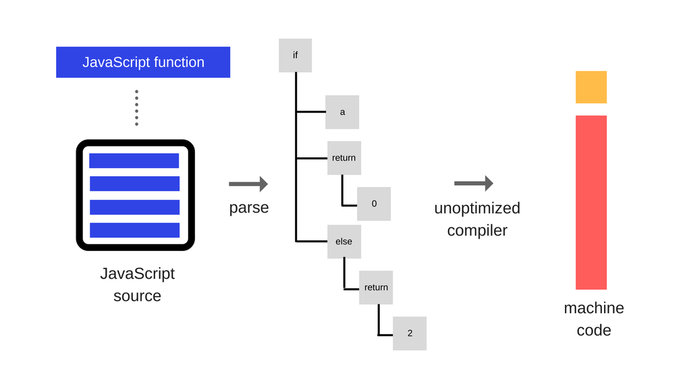
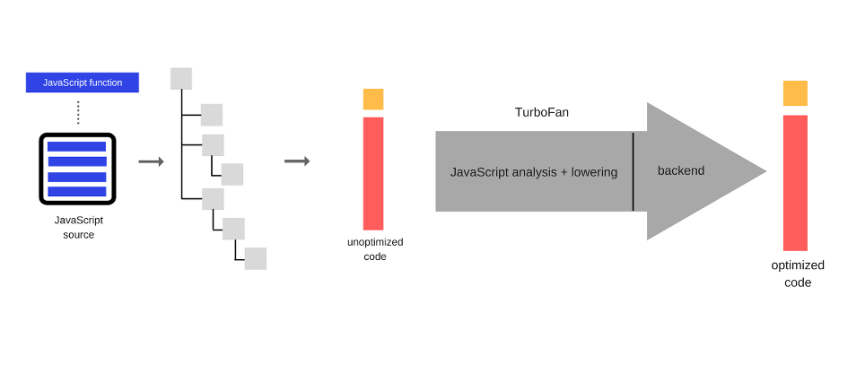
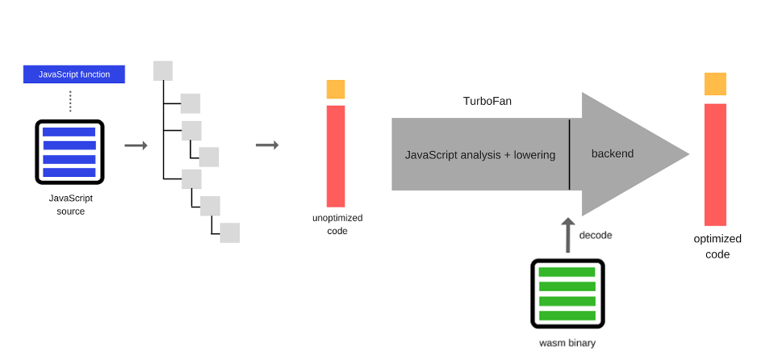

# WebAssembly 应用场景及 3D 地图优化示例

## 陈豫

---
## 目录

- 为何 Javascript 运行效率低
- WebAssembly 应用场景
- WebAssembly 学习成本
- 3D 地图优化示例

---
# 为何 Javascript 运行效率低
## Javascript 最初目的
创建一门足够简单的语言让开发者能容易地为网页增加交互，只要把代码拷贝过来调整一下就可以。

## 解决的典型问题
表单的校验。在当时网速很慢的的情况下，用户提交了一份表单，等待30秒后，服务器告诉你用户名长度必须在3-20之间，是一件很痛苦的事情。

---
# 为何 Javascript 运行效率低
## 网页的组成
- HTML - 核心
- CSS - 控制网页的外观
- Javascript - 为网页增加特别的一层可用性

## 黄金定律经常被人误解
很多开发者不是为网页增加一层可用性，而是用整层取代之，后果是，如果浏览器不支持JavaScript, 网站就完了。

---
# 为何 Javascript 运行效率低
## 浏览器大战
- IE 击败 Netscape Navigator
- Mozilla Firefox，Google Chrome，Safari 和 Opera 蚕食 IE

## 将错误进行到底
Javascript 喧宾夺主成为前端的绝对核心。如主流的 MVVM 设计模式框架：Angular, React, Vue, etc.

---
<!-- _backgroundColor: white -->
# 为何 Javascript 运行效率低
## 其实 Javascript 挺快的

---
# 为何 Javascript 运行效率低

### Javascipt：我只个鹰嘴锤，不是用来挖地道的。
---

# WebAssembly 应用场景
## WebAssembly 的设计目标
定义一个可移植，体积紧凑，加载迅速的二进制格式为编译目标，而此二进制格式文件将可以在各种平台（包括移动设备和物联网设备）上被编译，然后发挥通用的硬件性能以原生应用的速度运行。

#### 简单来说，就是弥补 Javascript 的性能问题。

---
<!-- _backgroundColor: white -->
# WebAssembly 应用场景
## V8 运行机制 - Javascript 1

---
<!-- _backgroundColor: white -->
# WebAssembly 应用场景
## V8 运行机制 - Javascript 2

---
<!-- _backgroundColor: white -->
# WebAssembly 应用场景
## V8 运行机制 - Webassembly

---

# WebAssembly 应用场景
## 主流语言性能对比
|| JS | WASM | Java | Python | Python3 | C++ |
|---|---|---|---|---|---|---|
|Fibonacci(40) | 998ms | 418ms | 334ms | >26s | >26s |213ms|

测试代码在项目的 examples/Benchmark 下。

---

# WebAssembly 应用场景
## Javascript 的性能不足在哪？
一句话概括：Javascript 不适合「CPU密集型」工作。

## WebAssembly 优化方案
- Javascript 负责 IO 及 UI
- WebAssembly 负责运算

---
# WebAssembly 应用场景
## WebAssembly 使用案例

- Figma — 基于浏览器的多人实时协作 UI 设计工具
- Google Earth — 支持各大浏览器的 3D 地图，而且运行流畅
- Web-DSP — 使用浏览器就能即时制作多媒体影音特效
- Rustynes - 网页版 NES 模拟器

---

# WebAssembly 应用场景
## 我们可能会用到哪些
- 3D地图
- VR/AR
- 图像识别
- 加密工具
- 模拟/仿真平台

---

# WebAssembly 学习成本
## 需要学习什么
- C/C++ 或 Rust

学会了上面任何一个，都会对 CPU 如何工作，如何管理内存有一定认识。这边认为对每个程序员都是必要的。（再次鄙视很多大学中将 Java 或 Python 做为主语言教学）

---

# WebAssembly 学习成本
## 需要学习什么
- GNU make
- Cmake

如果你选择了 C/C++ ，还需要会上面两个。因为在用库时 Emscripten 只支持 llvm bitcode 类型，所以大多数情况下是需要自己编译的。

---

# WebAssembly 学习成本
## 需要学习什么（单选）
- Emscripten 工具链
- Cheerp 工具链

前者更适合 C 程序，包装了一系列的宏，Orthodox C++ 风格。后者完全面向对象设计，Modern C++ 风格。

---

# WebAssembly 学习成本
## 难点
#### 相关文档少。
比如 Magnum 和 Unity 都说支持 Wasm 编译，但找了好久，甚至找不到一个 Demo。
#### 无 Opengl 上层库
写 Opengl 只能从基层入手。上层框架中最基本的 Vertex, Texture, Mesh, Geometry 等都需要自己实现。

---

# 3D 地图优化示例
- 上效果
- 上代码

代码位于 example/3dMap 下。